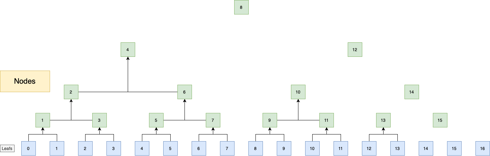

# Merkle Mountain Range (MMR) Implementation


[](https://goreportcard.com/report/github.com/dk-open/go-mmr)

## Introduction

The **Merkle Mountain Range (MMR)** is a cryptographic data structure designed for efficient, append-only data handling. It builds upon the concept of Merkle Trees by allowing the accumulation of data in multiple binary trees (mountains), ensuring that no data needs to be modified or recalculated as new data is added. This is especially useful for blockchain, timestamping, and verifiable log systems where append-only structures and proofs of inclusion are crucial.

The concept was initially proposed by Peter Todd and has been implemented in various blockchain-related projects like **OpenTimestamps** and **Grin**. Our implementation, however, improves upon the original by optimizing node indexing and navigation, making data operations faster and more efficient.

### Why MMR?
- **Efficient Appending**: MMR allows for new data to be appended without requiring all previously stored data to be available.
- **Compact Proofs**: MMR enables efficient, compact proofs of data inclusion, which makes it perfect for decentralized systems where bandwidth and storage efficiency are important.
- **Scalability**: With its append-only nature, MMR structures scale very well with growing datasets.

### Key Differences in This Implementation
Our MMR implementation introduces an enhanced indexing mechanism for faster node navigation, offering a more intuitive and efficient traversal experience. The key optimizations include:
- **Optimized Node Indexing**: Improved node indexing makes navigation across the structure significantly faster compared to the original. This reduces complexity when traversing nodes, especially in large datasets.
- **Support for Multiple Hash Functions**: Unlike some implementations, ours supports multiple cryptographic hash functions like SHA-256, Blake2b, Argon2, and more. This adds flexibility for developers to choose the hashing algorithm that best fits their needs.
- **Enhanced Proof of Inclusion** (Coming Soon): A focus on simplifying and optimizing the generation and verification of proofs for append-only data, which is especially important for decentralized and distributed systems.

For more details on the original MMR implementation:
- [OpenTimestamps MMR Documentation](https://github.com/opentimestamps/opentimestamps-server/blob/master/doc/merkle-mountain-range.md)
- [Grin MMR Documentation](https://github.com/mimblewimble/grin/blob/master/doc/mmr.md)

### Visualization of the MMR Structure


- **Blue nodes**: Represent the actual data objects in the structure.
- **Green nodes**: Internal nodes that support the structure by linking the data in a verifiable way.

---

## Features
- **Efficient Node Storage**: For `N` data objects, approximately `N` supporting nodes are required, making the total storage size approximately `2 * N` nodes.
- **Support for Multiple Hash Functions**: Including Argon2, SHA-256, Blake2b, and more.
- **Optimized Indexing**: Simplified navigation between nodes, making traversal and data retrieval faster than traditional implementations.
- **Append-Only Nature**: You can add new elements without having access to previously appended data, improving scalability.

### Use Cases
- **Blockchain**: Ideal for maintaining verifiable transaction histories.
- **Timestamping**: Ensures that data existed at a specific point in time, without requiring access to all historical data.
- **Verifiable Logs**: Perfect for applications where data integrity and proof of existence are crucial.

---

## Requirements

- **Go Version**: Latest version 1.23.1 (Supports Go 1.18+)

## Installation

To include this MMR implementation in your Go project, simply run:

```bash
go get -u github.com/discretemind/mmr
```

## Example Usage

```go
package main

import (
	"context"
	"fmt"
	"github.com/dk-open/go-mmr/merkle"
	"github.com/dk-open/go-mmr/store"
	"github.com/dk-open/go-mmr/types"
	"github.com/dk-open/go-mmr/types/hasher"
)

func main() {
	// Initialize memory-based stores for indexes and hashes
	memoryIndexes := store.MemoryIndexSource[uint64, types.Hash256]()
	memoryHashes := store.MemoryHashSource[types.Hash256]()
	hf := hasher.Argon2

	// Create a new MMR instance using Argon2 hashing
	m := merkle.NewMountainRange[uint64, types.Hash256](hf, memoryIndexes, memoryHashes)
	ctx := context.Background()

	// Add data to the MMR
	for i := 0; i < 10; i++ {
		data := []byte(fmt.Sprintf("test data %d", i))
		h := hf(data)
		if err := m.Add(ctx, h); err != nil {
			fmt.Println("Error adding data:", err)
			return
		}
	}

	// Retrieve and verify data
	for i := 0; i < 10; i++ {
		h, err := m.Get(ctx, uint64(i))
		if err != nil {
			fmt.Println("Error getting data:", err)
			return
		}
		fmt.Printf("Data at index %d: %x\n", i, h)
	}

	// Print the size of the MMR
	fmt.Println("MMR size:", m.Size())
}
```

## Future Work
- **Proof of Inclusion:**: We are working on implementing optimized proof generation and verification for verifying that specific data is part of the MMR without requiring access to the entire structure.

## License

This project is licensed under the MIT License. See the [LICENSE](LICENSE) file for more details.

